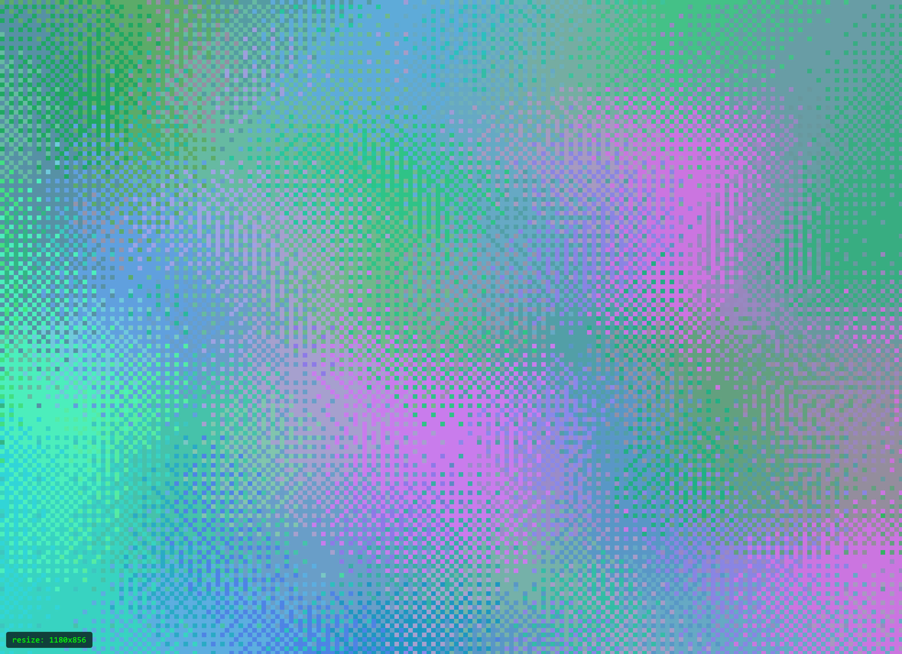
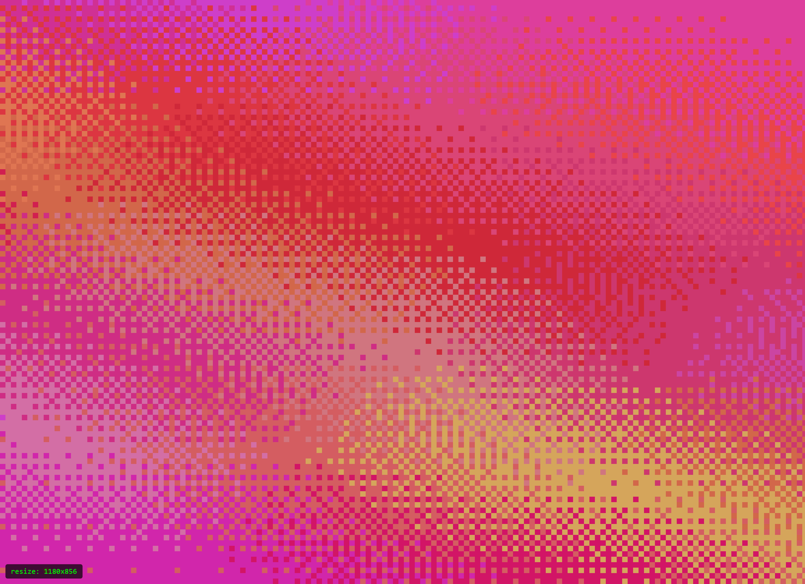
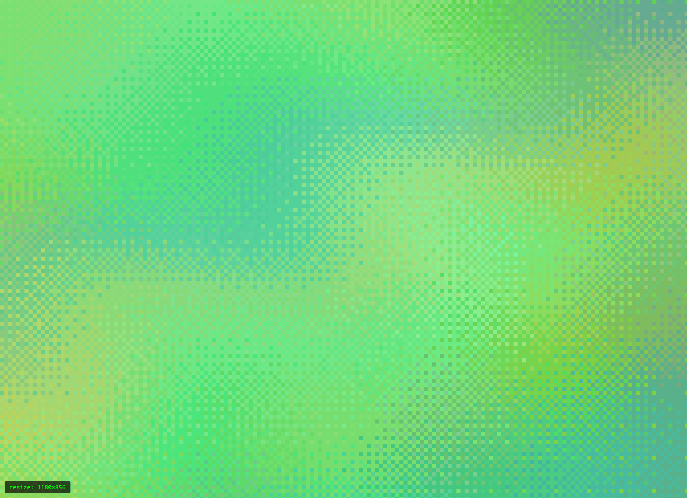
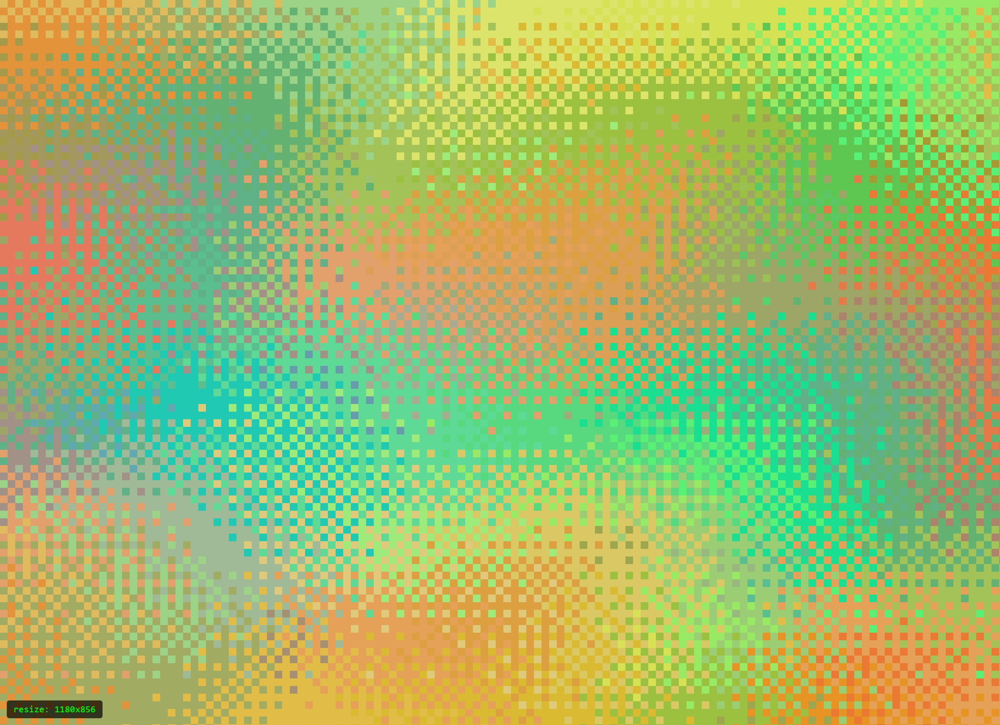

# Dither

A generative gradient dithering tool that runs in the browser. Creates ordered-dither gradient patterns with animated warp layers.

<p align="center">
  
  
  <br>
  
  
</p>

## [Try it live](https://oskarpajka.github.io/dither)

## Features

- Ordered dithering with configurable pixel size (1-15px)
- Layered gradient bands with randomized color palettes
- Animated warp effects with adjustable speed, depth, and loop duration
- WebGL2 GPU acceleration with automatic CPU fallback
- Random palette generation with manual seed control for reproducible results
- Adjustable aspect ratio (free, 1:1, 4:3, 16:9, 3:2, or custom)
- Fixed resolution override
- PNG export of any frame
- WebM video export of animations
- Dark mode
- Responsive layout (desktop and mobile)

## Usage

Open `index.html` in a modern browser, or serve the directory with any static file server.

```
npx serve .
```

### Controls

| Control | Description |
|---|---|
| Pixel Size | Size of each dither cell (1-15px) |
| Layers | Number of gradient layers (2-8) |
| Warp | Animation warp intensity |
| Colors | Number of colors in the palette |
| Aspect Ratio | Free, 1:1, 4:3, 16:9, 3:2, or custom |
| Resolution | Fixed output resolution (0 = auto) |
| Animation | Toggle animation; adjust speed, depth, framerate, and loop duration |
| Seed | Random or fixed seed for reproducible patterns |

### Export

- **PNG** - Downloads the current frame
- **Video** - Exports animation as a WebM video with configurable resolution (up to 7680x4320), framerate (up to 120 fps), and bitrate (up to 500 Mbps)

## Architecture

- `state.js` - shared mutable state object
- `config.js` - random configuration generator (palette, layers, warp waves)
- `renderer-cpu.js` - Canvas 2D CPU renderer with trig hoisting
- `renderer-webgl.js` - WebGL2 GPU renderer with fragment shader
- `ui.js` - small UI helpers (checkbox component)
- `app.js` - main entry point, UI construction, event handling, export

## Browser Support

Requires a modern browser with Canvas 2D support. WebGL2 is used when available for faster rendering. Tested in Chrome, Firefox, and Safari.

## License

MIT
